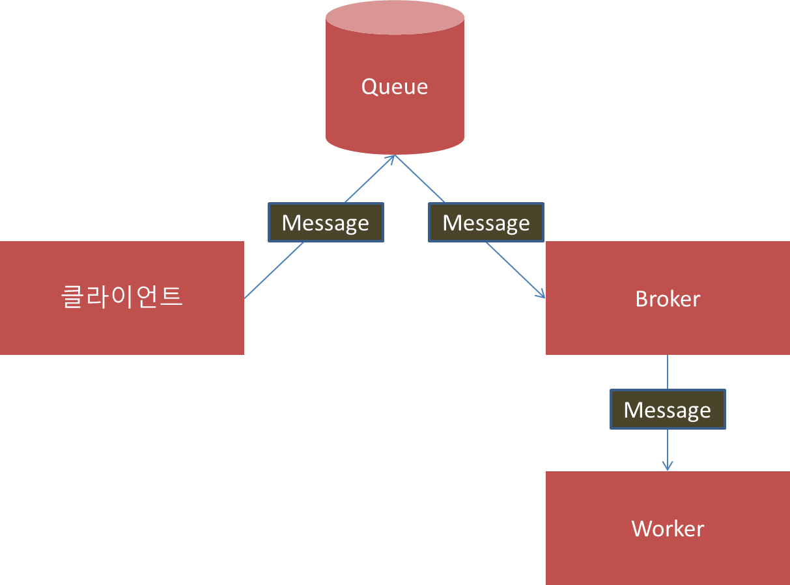

# Redis Docker

Redis 를 도커로 서비스한다.
자세한 내용은 https://github.com/code-machina/redis-job-py 를 참조 한다.

```
$ docker pull redis
$ docker run --name py-redis -d -p 6379:6379 redis
# docker open shell
$ docker exec -i -t py-redis /bin/bash
```

## Django 서비스 프로젝트를 구성

django 프로젝트 시작

```bash
django-admin startproject msjob

vim msjob/msjob/celery.py
```


```python
python code
```

## Celery 요약

### Task Queue 란?

Task 큐는 작업을 쓰레드와 머신에 분배하는 메커니즘으로 사용한다.

- Task 큐의 입력으로는 task 라고 불리는 작업 단위이다. 
- 할당된 워커 프로세스는 지속적으로 task 큐를 감사하여 새로운 작업을 확인한다. 
- `Celery` 는 message 를 통해 통신한다. `broker` 를 사용하여 클라이언트와 워커를 중재한다. 작업을 초기화하기 위해 클라이언트는 메시지를 큐에 추가하고 브로커는 메시지를 worker 에게 전달한다. 




- [Jistol's Docker Redis](https://jistol.github.io/docker/2017/09/01/docker-redis/)
- [Public Guide for Docker Redis](https://docs.docker.com/samples/library/redis/#redisversion)
- [celery-django] (http://docs.celeryproject.org/en/latest/django/first-steps-with-django.html)