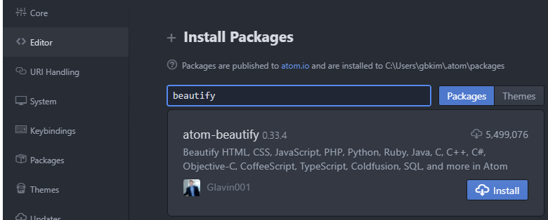

# Awesome and Basic Atom Plugin

I'm introducing Atom Plugins to make your work easy 😝

## Beautify

Beautify your code(indenting, organizing, and enhancing readability)

|     Command    |    OS   |                Desc                |
| :------------: | :-----: | :--------------------------------: |
|    Ctrl + ,    | Windows | Go to Settings to install packages |
| Ctrl + Alt + b | Windows |          Beautify Current          |


**Suppports:**

- Every Languages (C, Markdown, C++, javascript, etc)   



## Emmet

Reduce repetitious work

|Command|OS|Desc|
|:---:|:---:|:---:|
| Ctrl + , | Windows| Go to Settings to install packages |
|Ctrl + e|Windows|Expand your abbreviations|

Sample

```html
ul>li*5
```

After commanding expansion (Ctrl + e)

```html
<ul>
  <li></li>
  <li></li>
  <li></li>
  <li></li>
  <li></li>
</ul>
```

## Pigment

display Color (like #FF11FF) in your project and files.

|Command|OS|Desc|
|:---:|:---:|:---:|
| Ctrl + , | Windows| Go to Settings to install packages |


You will see the color in your project and files.


